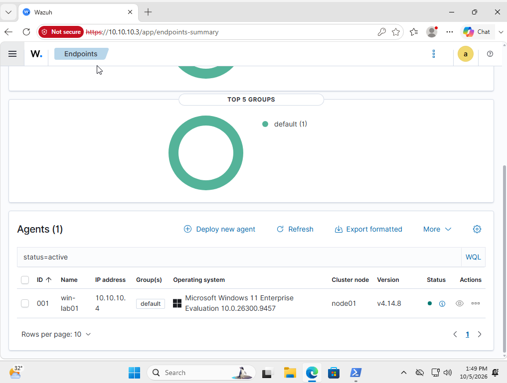
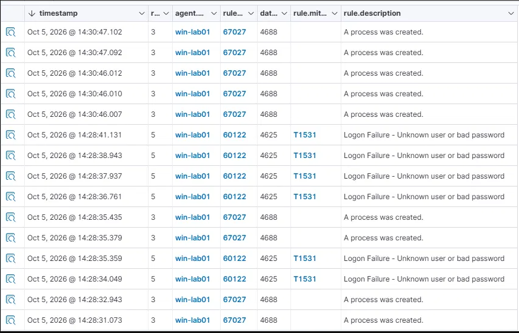
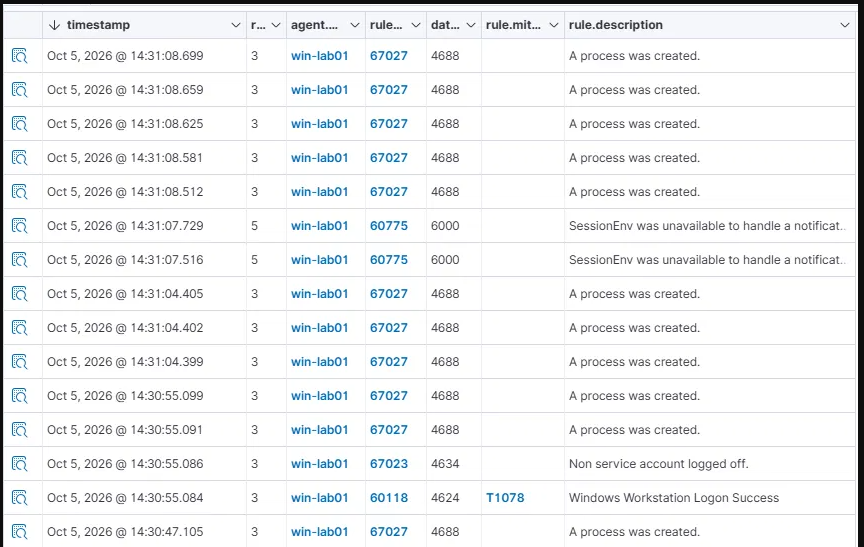
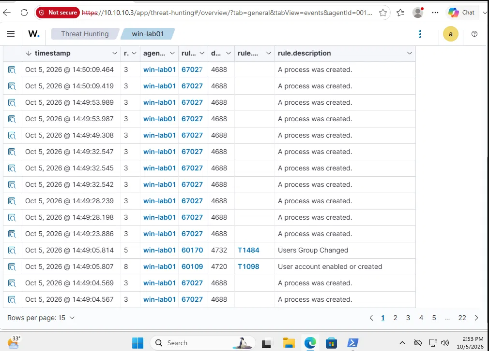
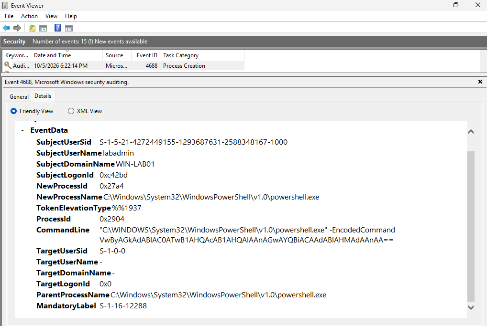
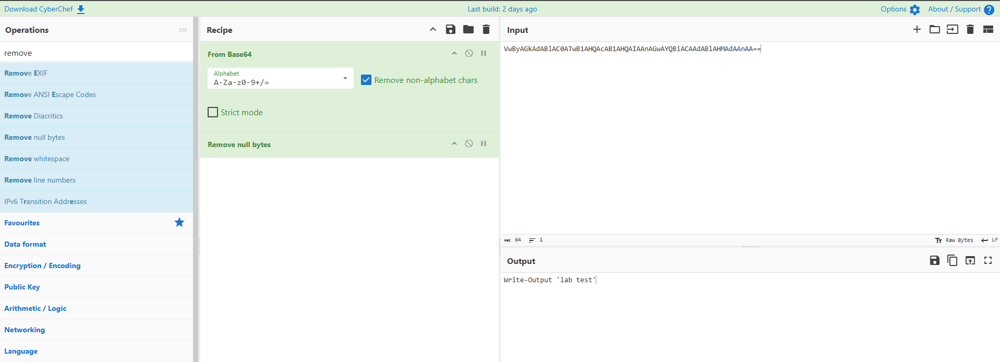

# Wazuh SOC Home Lab

A home lab built to practise L1 SOC work: standing up a SIEM, monitoring a Windows endpoint, simulating two common attack patterns, and triaging the resulting alerts.

## Architecture

- **Wazuh server** (Ubuntu Server 24.04, all-in-one install: manager, indexer, dashboard)
- **Windows 11 endpoint** with the Wazuh agent installed
- Both VMs on an isolated VirtualBox NAT Network (`10.10.10.0/24`), with no exposure to the host's home network

<!-- Drop in the screenshot showing win-lab01 as Active in the Agents/Endpoints view -->

## Scenario 1: Repeated failed logons followed by a success

**What I did:** Signed in as a test account (`labuser`) with the wrong password 6-8 times in a row, then signed in with the correct password.

**What fired:**
- 6× Event ID 4625 (Logon Failure - Unknown user or bad password), between 14:28:32 and 14:28:41
- Windows' own lockout delay triggered after the repeated failures
- Event ID 4624 (Windows Workstation Logon Success) at 14:30:55, roughly two minutes after the last failure

<!-- Screenshot of the 4625 events in Threat Hunting / Events -->

<!-- Screenshot of the 4624 event following the failures -->

**Verdict:** True positive (simulated). A cluster of failures against one account, followed by a success, is a password-guessing pattern worth investigating further.

**MITRE ATT&CK:** Wazuh mapped this to T1531 (failures) and T1078 Valid Accounts (the success). This overlaps with the more commonly cited T1110 Brute Force for this kind of pattern.

**Recommended action:** Confirm with the account owner that the failures and the eventual login were legitimate (forgotten password, mistyped attempts). If unconfirmed, treat the account as potentially compromised: revoke active session, disable the account, force a password reset and review any activity under it since the successful logon.

## Scenario 2: New administrator account and an encoded PowerShell command

**What I did:** Created a new local account (`labtest2`) and added it directly to the Administrators group, then ran a PowerShell command with an encoded (base64) payload.

**What fired:**
- Event ID 4720 (User account created) at 14:49:05
- Event ID 4732 (Member added to a security-enabled local group) a few milliseconds later
- Event ID 4688 (Process creation), with the command line containing `-EncodedCommand` and the base64 payload

<!-- Screenshot of the 4720/4732 events together -->

<!-- Screenshot of the 4688 event showing the -EncodedCommand command line -->

**Decoding the command:** I copied the base64 string from the command line field and ran it through CyberChef (From Base64 → Decode text, UTF-16LE), which decoded to `Write-Output 'lab test'`.

<!-- Screenshot of the CyberChef decode -->

**Verdict:** True positive (simulated). A new account created and immediately placed in Administrators is high-risk on its own; paired with an encoded PowerShell command on the same host within the same minute, the pattern is a strong indicator of an attacker establishing persistence and attempting to obscure what they're running.

**MITRE ATT&CK:** T1098 / T1484 (account and group manipulation), T1059.001 (PowerShell).

**Recommended action:** Disable the new account immediately pending confirmation it was authorized. Decode and review any obfuscated commands run under it. Check for further activity from the account or host (new processes, outbound connections, additional account changes).

## Triage summary

| Scenario | Key indicators | Verdict | Escalate? | Recommended action | ATT&CK |
|---|---|---|---|---|---|
| Failed logons then success | 6× 4625 (14:28:32-14:28:41), 4624 (14:30:55), same account/host | True positive | Yes | Confirm with user; disable/revoke and reset password if unconfirmed; review account activity | T1531 → T1078 |
| New admin account | 4720 + 4732 (14:49:05), account `labtest2` added to Administrators | True positive | Yes | Disable account if unauthorized; review who created it | T1098 / T1484 |
| Encoded PowerShell | 4688, `-EncodedCommand` flag, decoded to a test string | True positive | Yes | Review what ran under the account; verify intent; check for further execution | T1059.001 |

## What I learned

- Wazuh has its own rule-to-ATT&CK mappings(for example, T1531 and T1078 for a brute-force-then-success pattern, rather than T1110). Worth checking a SIEM's actual mappings.
- Mid-lab, the Windows agent lost its connection to the manager and reconnected on its own after a few minutes. Troubleshooting it (checking `agent_control -l` on the manager, the agent's local `ossec.log`, and the indexer's document count directly via the API) was a good reminder that a SIEM pipeline has several moving parts(agent, manager, indexer, dashboard) and that an alert not showing up doesn't always mean the activity didn't happen, it may just have not shown up yet on the dashboard.
- It is always good to know where to locate and understand raw logs incase unexpected behaviour by SIEM especially in time-sensitive cases.

## Next steps

- Build a script to correlate the failed-logon-then-success pattern automatically and produce a prioritised triage summary (in progress)
